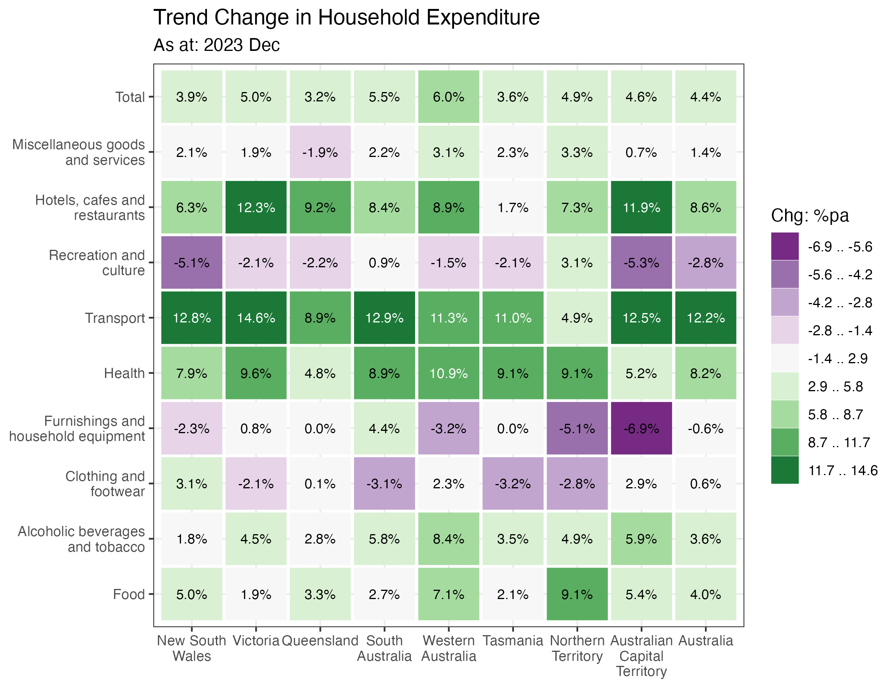

# Macroeconomics

## Household Expenditure Heatmap



Update script: 

```r
source("mexp.R")
```

Interactive version: [Household Expenditure Heatmap](https://observablehq.com/d/a993d427915fd21b)

## Monthly CPI trends


```r
source("mcpi.R")
```

